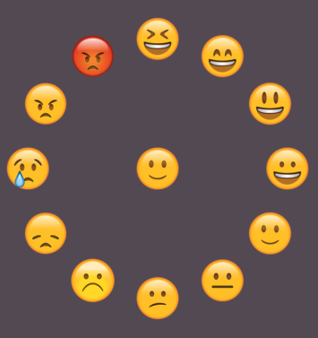

# MoodPicker.js
##### Used for picking a mood.

## Props
- *items* - items to display
- *currentMood* - selected mood
- *items* - width of the component
- *onMoodSelect* - handler for selecting a mood

